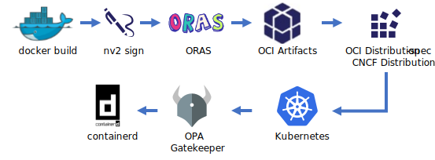
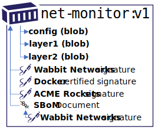

# Notary v2 Status

Notary v2 provides for multiple signatures of an [OCI Artifact][oci-artifacts] (including container images) to be persisted in an [OCI conformant][oci-distribution-conformance] registry. The artifacts, and its signatures should be easily copied within and across [OCI conformant][oci-distribution-conformance] registries. To support deployments, signing an OCI Artifact will not change the `@digest` or `artifact:tag` reference. To support content movement across multiple certification boundaries, Notary v2 provides for multiple signatures attested to a single artifact.

To deliver on the Notary v2 goals of cross registry movement of artifacts with their signatures, changes to several projects are anticipated, including [OCI distribution-spec][oci-distribution-spec], [CNCF Distribution][cncf-distribution], [OCI Artifacts][oci-artifacts], [ORAS][oras] with further consumption from projects including [containerd][containerd], [OPA][opa], [Gatekeeper][gatekeeper] and the [docker client][docker-client].

## The Notary v2 Journey

Notary v2 [kicked off in December of 2019][notaryv2-kickoff] with a [broad range of attendees][kickoff-attendees]. The effort defined success goals, including adoption by all major vendors & projects, enabling content to be signed and flow within and across [OCI distribution-spec conformant][oci-distribution-conformance] registries. Throughout 2020, the group agreed upon a set of [Notary v2 requirements][nv2-requirements] and [scenarios][nv2-scenarios] enabling spec and design conversations to be grounded in a set of [goals][nv2-requirements] and [non-goals][non-requirements]. Prototypes, based on the requirements have started, focusing on the primary areas on innovations.

## Top Areas of Focus

To complete Notary v2, three key areas of focus were identified:

1. [Definition of a Notary v2 Signature](#definition-of-a-notary-v2-signature)
1. [Registry Persistance, Discovery and Retrieval](#registry-persistance-discovery-and-retrieval)
1. [Key Management](#key-management)

### Definition of a Notary v2 Signature

A Notary v2 signature would attest to the digest of an artifact, associating it with a signing key.

### Registry Persistance, Discovery and Retrieval

An artifact must be capable of being pushed to a registry, with a signature being added independently from the artifact. This enables the originating author of the content to sign the artifact, and subsequent entities to add additional signatures, attesting to its validity as they determine.

The Notary v2 workflow ([outlined in Scenario #0](https://github.com/notaryproject/requirements/blob/main/scenarios.md#scenario-0-build-publish-consume-enforce-policy-deploy)) enables Wabbit Networks to sign their `net-monitor` software. Docker Hub may endorse Wabbit Networks software, providing an aggregator certification by adding a Docker Hub signature. This would allow customers like ACME Rockets to not necessarily know of small vendors like Wabbit Networks, but allow the ACME Rockets engineering team to pull Docker Certified content. As ACME Rockets imports the content, scans and validates it meets their requirements, they add an additional ACME Rockets signature, which must exist for any production usage within the ACME Rockets environment.

#### Registry Persistance and Retrieval

Registry persistance and retrieval are defined through the [OCI distribution-spec][oci-distribution-spec], with [OCI Artifacts][oci-artifacts] capabilities to store non-container images.

#### Registry Discovery

Registry discovery of linked artifacts enables the finding a signature, based on the target artifact. In the Notary v2 example, the ACME Rockets production servers must be capable of efficiently finding the ACME Rockets signature for the `net-monitor:v1` image. Once the signature is identified, but a content addressable digest, the Notary v2 client may validate the signature.

### Key Management

Key Management involves the following key scenarios:

- Signing with private keys
- Publishing and discovery of public keys for consumers to validate signatures
- Key revocation, including support for air-gapped environments

Private key management is beyond the scope of the Notary v2 effort, as companies have well defined practices that are internal to their software development.

Publishing and discovery of public keys should be easy for consumers to acquire, however, Notary v2 will not implicitly support a **T**rust **o**n **F**irst **U**se (TOFU) model.

Key revocation must support air-gap environments, enabling users to validate keys when resources inside a network isolated environment are unable to reach public endpoints.

### Designing Complex Systems Across Multiple Subject Matter Experts

To deliver Notary v2, we recognized the need of experts from multiple backgrounds, experiences and skill sets. The various perspectives were needed to assure we learned from past efforts and learned from subject matter experts.

As subject matter experts converged, we found it difficult for the various SMEs to understand other components of the end to end workflow. The typical Open Source model for authoring specs involves “writing it down”. Contributors Create a pull request on some markdown so all can review. However, we learned _The problem isn’t in the writing, it’s in the reading._

To facilitate better communications across the skill sets, respecting everyone's time, we recognized the need to invest in models and prototypes. We followed the design patterns of other large, complex projects like Antoni Gaudí's design of [The Sagrada Famila](https://simple.wikipedia.org/wiki/Sagrada_Fam%C3%ADlia). The [sketch, prototype, build approach](https://stevelasker.blog/2020/07/31/sketch-prototype-build/) would enable the various experts to focus on their component, while understanding where they plug-into other components of the design.

As a result, we identified the following stages of the Notary v2 effort:

1. Define Requirements
1. Build Prototypes
1. Validate prototypes - learning, refining requirements, iterating prototypes
1. Author a Notary v2 Spec

## February 2021

Since December 2019, teams have been meeting regularly, as captured in the [Notary v2 notes][nv2-notes]. Requirements and a focused prototype have been completed, enabling conversations to upstream projects.

Updates on the **Areas of Focus** and **Stages** are provided below.

### Stage Progress (Feb 2021)

1. [**Define Requirements**](#define-requirements-(2021-02))
1. [**Build Prototypes**](#build-prototypes-(2021-02))
1. [**Validate Prototypes**](#validate-prototypes-(2021-02))
1. [*Author a Notary v2 Spec*](#author-a-notary-v2-spec-(2021-02))

#### Define Requirements (2021-02)

[Baseline requirements](https://github.com/notaryproject/requirements#requirements) have been defined, enabling focused prototyping. Additional requirements are being discussed as PRs:

- [Add ephemeral clients as a core scenario #25](https://github.com/notaryproject/requirements/issues/25)
- [Should tags be signed in addition to digests? #43](https://github.com/notaryproject/requirements/issues/43)

#### Build Prototypes (2021-02)

In September of 2020, a focused prototype for signing, integration with a registry and client validation were completed.

The prototype focused on:

- Signing a container image with a prototype of an [nv2 client](https://github.com/notaryproject/nv2).
- Pushing to an instance of the [CNCF Distribution][cncf-distribution] based registry, with exploratory [prototype enhancements](https://github.com/notaryproject/distribution/pull/2).
- Discovery of signatures, based on a [verification by reference](https://github.com/notaryproject/requirements/blob/main/verification-by-reference.md) design.
- Validation of a signature with the `nv2` client, using the public key pair used to sign the artifact.

Details of the September 2020 Prototype:

- [Video of prototype-1](https://youtu.be/ciNW19F_T_8?t=367)  
- [Steps to reproduce the prototype-1 nv2 client](https://github.com/notaryproject/nv2/tree/prototype-1/docs/nv2)

The prototypes have enabled participants and subject matter experts to identify additional areas of focus, such as [policy management capabilities](https://github.com/notaryproject/requirements/issues/42). Policy management will be added as an area of focus.

### Areas of Focus

1. [Definition of a Notary v2 Signature](#definition-of-a-notary-v2-signature-(2021-02))
1. [Registry Persistance, Discovery and Retrieval](#registry-persistance-discovery-and-retrieval-(2021-02))
1. [Key Management](#key-management-(2021-02))
1. [Policy Management](#policy-management-(2021-02))

#### Definition of a Notary v2 Signature (2021-02)

A [Prototype-1 Signature Spec][nv2-signature-spec] has been defined, serializing as a [JWT](https://tools.ietf.org/html/rfc7519) variant. While additional signature types may be added, a baseline signature spec has enabled validation of the other areas of focus.

#### Registry Persistance, Discovery and Retrieval (2021-02)

To validate the end to end experiences, an experimental change to [CNCF Distribution](https://github.com/notaryproject/distribution/pull/2/) enabled linking of a container image and an independent Notary v2 signature.

An experimental docker plug-in called [docker-generate](https://github.com/shizhMSFT/docker-generate) generates a local manifest, used to generate the signature. The plug-in extends the `docker push` command to push the signature and make an additional link API request of the registry.

This prototype inspired a new [OCI Artifact Manifest][oci-artifact-manifest], which provides a way for artifacts to define the target artifact (`manifest`) they are linking to.

Additional signature types have also been discussed, including [IBM Simple Signing](https://cloud.ibm.com/docs/Registry?topic=Registry-registry_trustedcontent) and a [cosign prototype](https://github.com/projectcosign/cosign), developed by [Dan Lorenc](https://github.com/dlorenc) which would benefit from the [OCI Artifact Manifest][oci-artifact-manifest] linking proposal.

[OCI Distribution-spec list API requirements](https://github.com/opencontainers/distribution-spec/pull/229), to support a `manifests/links` listing API have also started.

#### Key Management (2021-02)

Early on, a preliminary [Notary v2 thread model](https://github.com/notaryproject/requirements/blob/main/threatmodel.md) was defined, with [key management requirements forming](https://github.com/notaryproject/requirements/pull/38). Key management is an area of additional focus in 2021 as we focus on:

- Publishing and discovery of public keys for consumers to validate signatures
- Key revocation, including support for air-gapped environments

#### Policy Management (2021-02)

As OPA/Gatekeeper prototypes are started in 2021, a set of policy management requirements will surface.

#### Author a Notary v2 Spec (2021-02)

A [Notary v2 signature][nv2-signature-spec] spec has been prototyped. As the OCI Artifact Manifest and Manifest Link API proposals proceed, with subsequent prototype validations, the Notary v2 spec will begin.

### Plans for 2021

2020 focused on requirements gathering and initial prototypes to validate the requirements could be met. 2021 will focus on building end to end prototypes, including integration with Kubernetes, OPA and Gatekeeper. The changes required for registry persistence, discovery and retrieval will be hardened enabling registry operators and registry projects to implement the changes. The goal being user validations, and gap analysis of requirements and/or prototypes. These final validations will lead to a Notary v2 specification.

The following goals are set for 2021:

1. Extend [OCI Artifacts][oci-artifacts] to support reverse lookup capabilities for signatures and SBoMs.
    1. An [oci.artifact.manifest proposal][oci-artifact-manifest] has begun review.
    1. [Design a manifest](https://github.com/opencontainers/distribution-spec/pull/229) - linked-list lookup distribution API for discovering linked artifacts, such as Notary v2 signatures.
    1. Once a stable proposal is reached, implement it in [CNCF Distribution][cncf-distribution] with the ability for users to self-instance the solution.
    1. The design should be strong enough for cloud providers and registry projects to implement in sand-boxed environments for user validation.
1. Prototype policy management rules, using something like [OPA][opa] and [Gatekeeper][gatekeeper].
1. Build out key management requirements, including discovery of public keys, and key revocation scenarios across public and private/air-gapped environments.
1. Engage customers for feedback on the end to end capabilities.
1. Being a Notary v2 spec that captures the learnings

[cncf-distribution]:            https://github.com/distribution/distribution  
[containerd]:                   https://github.com/containerd
[docker-client]:                https://www.docker.com/products/docker-desktop
[gatekeeper]:                   https://github.com/open-policy-agent/gatekeeper
[kickoff-attendees]:            https://github.com/notaryproject/meeting-notes/blob/main/meeting-notes-2019.md#attendees
[moby]:                         https://github.com/moby
[notaryv2-kickoff]:             https://github.com/notaryproject/meeting-notes/blob/main/meeting-notes-2019.md#notary-v2-kickoff-meeting
[non-requirements]:             https://github.com/notaryproject/requirements#non-goals
[nv2-notes]:                    https://hackmd.io/_vrqBGAOSUC_VWvFzWruZw
[nv2-requirements]:             https://github.com/notaryproject/requirements
[nv2-scenarios]:                https://github.com/notaryproject/requirements/blob/main/scenarios.md
[nv2-signature-spec]:           https://github.com/notaryproject/nv2/tree/prototype-1/docs/signature
[nv2-key-management]:           https://github.com/notaryproject/requirements/pull/38/
[nv2-distribution-spec]:        https://github.com/opencontainers/artifacts/pull/29
[oci-artifacts]:                https://github.com/opencontainers/artifacts
[oci-artifact-manifest]:        https://github.com/opencontainers/artifacts/pull/29
[oci-distribution-spec]:        https://github.com/opencontainers/distribution-spec
[oci-distribution-conformance]: https://github.com/opencontainers/oci-conformance
[opa]:                          https://github.com/open-policy-agent
[oras]:                         https://github.com/deislabs/oras
